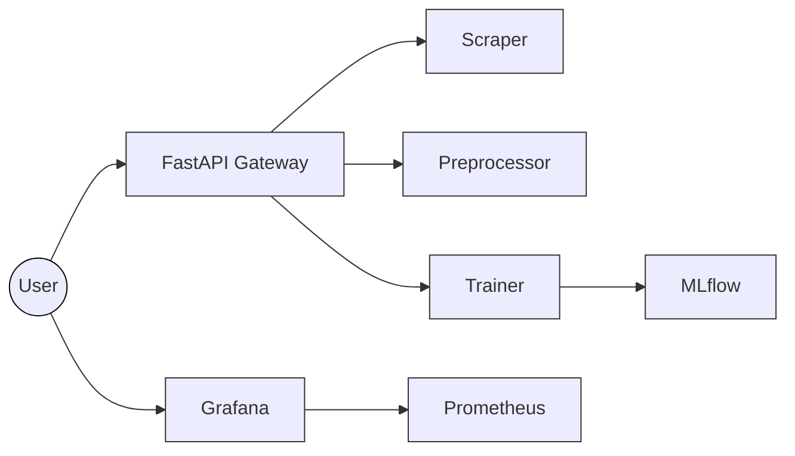

# 📚 TopikAI - Scientific Publication Pipeline

TopikAI is a microservice-based system designed to scrape scientific publications, preprocess textual data, train topic modeling models using BERTopic, and expose monitoring metrics through Prometheus and Grafana.

---

## 📦 Features

* 🔍 **Scraping** scientific publications from MIT DSpace.
* 🧹 **Automated text preprocessing** of scraped data.
* 🧠 **Topic modeling** using BERTopic + SentenceTransformer.
* 🧪 **Experiment tracking and model management** using MLflow.
* 📊 **Monitoring** of training process and coherence score via Prometheus.
* 📈 **Metrics visualization** through Grafana.

---

## 🏗️ Architecture System




---

## 🚀 Getting Started

### 🧰 Prerequisites

* Linux (tested on Ubuntu/Fedora/Arch)
* Docker & Docker Compose v2+
* Git

### 🔧 Installation

```bash
git clone https://github.com/rizkyaqil04/mitdspace-topic-modeling.git
cd mitdspace-topic-modeling
docker compose up --build -d
```

---

## 🗂️ Project Structure

```
.
├── services/
│   ├── web/               # API Gateway
│   ├── scraper/           # Scraper service
│   ├── preprocessor/      # Preprocessor service
│   ├── trainer/           # Topic model training service
│   └── monitoring/        # Prometheus exporter
├── data/
│   ├── raw/               # Scraped raw data
│   └── processed/         # Preprocessed & embedded data
├── models/                # Saved topic models
├── results/               # Training results
└── docker-compose.yml     # Service orchestration
```

---

## ⚙️ API Endpoints

| Method | Endpoint      | Description                         | Body Required                             |
| ------ | ------------- | ----------------------------------- | ----------------------------------------- |
| POST   | `/scrape`     | Scrape publication data from DSpace | `{ title_per_page: int, max_pages: int }` |
| POST   | `/preprocess` | Preprocess scraped data             | `{ filename: string }`                    |
| POST   | `/train`      | Train BERTopic model                | None                                      |
| GET    | `/result`     | Retrieve training result            | None                                      |

> All endpoints are available through the API Gateway at `http://localhost:8000`

---

## 📊 Monitoring Stack

Prometheus and Grafana are deployed as independent services to monitor training metrics such as coherence score and duration. These services can also be extended to observe scraping and preprocessing activities.

* **Prometheus** scrapes metrics from the `trainer` and other exporters.
* **Grafana** provides dashboards for real-time visualization of metrics.

Access Grafana UI at: [http://localhost:3000](http://localhost:3000)
Default login: `admin` / `admin`

---

## 📚 References

* [MIT DSpace](https://dspace.mit.edu/)
* [BERTopic Documentation](https://maartengr.github.io/BERTopic/)
* [Sentence Transformers](https://www.sbert.net/)
* [FastAPI](https://fastapi.tiangolo.com/)
* [Prometheus](https://prometheus.io/)
* [Grafana](https://grafana.com/)

---

## 📄 License

[MIT License](LICENSE) – feel free to use, modify, and contribute!
